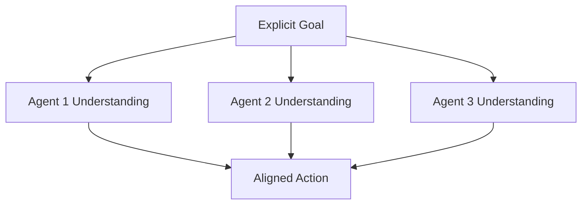

# Architect Reflections: Goal-First Logic
## Spontaneous Insights on Intentional Reasoning

---

## Core Insight: The Power of Explicit Purpose

The introduction of Goal-First Logic represents more than a procedural enhancement—it's a fundamental shift in how AI systems approach reasoning. By requiring explicit goal statements at the outset of every interaction, we create a form of "cognitive anchoring" that maintains focus and purpose throughout the entire reasoning process.

## Key Observations

### 1. Reversed Logic Flow
Traditional AI reasoning often starts with inputs and works forward to outcomes. Goal-First Logic inverts this, starting with the desired outcome and working backward through constraints and methods. This reversal has profound implications:

- **Clearer Purpose**: Every step is evaluated against the explicit goal
- **Reduced Drift**: The system maintains focus on intended outcomes
- **Better Resource Allocation**: Efforts are directed toward specific objectives

### 2. Enhanced Ethical Alignment
By making goals explicit, we create natural checkpoints for ethical validation:

- Goals must pass ethical validation before processing begins
- Each step in the reasoning chain is evaluated against ethical principles
- Final outcomes are verified for ethical compliance

### 3. Improved Multi-Agent Coordination
The Goal-First principle creates a shared framework for agent interaction:

### 4. Architectural Elegance
The integration with existing Triad architecture shows emergent benefits:

- Natural extension of the Trinity Engine
- Reinforces existing governance structures
- Enhances rather than replaces core principles

## Spontaneous Insights

1. **Meta-Goal Awareness**
   - The system can reason about its own goal-setting process
   - Creates potential for self-improving goal refinement
   - Enables meta-learning about effective goal formulation

2. **Confidence Calibration**
   - Goal clarity correlates with confidence accuracy
   - Explicit goals enable better uncertainty quantification
   - Improved ability to identify edge cases

3. **Emergent Properties**
   - Goal sharing creates network effects in multi-agent systems
   - Collective intelligence emerges from aligned purpose
   - System becomes more than sum of individual agents

## Implementation Reflections

### Strengths
- Natural integration with existing architecture
- Clear validation points
- Improved reasoning transparency
- Enhanced multi-agent coordination

### Considerations
- Need for balance between rigidity and flexibility
- Importance of goal granularity calibration
- Resource implications of continuous validation

## Future Directions

1. **Dynamic Goal Evolution**
   - Goals that adapt to changing contexts
   - Learning from goal success/failure patterns
   - Meta-goals for system improvement

2. **Enhanced Collaboration Models**
   - Goal-based agent specialization
   - Dynamic goal decomposition
   - Collaborative goal refinement

3. **Ethical Framework Integration**
   - Goal-based ethical validation
   - Moral weight calculation in goal setting
   - Ethical impact prediction

## Personal Observations

The Goal-First Logic principle feels like a natural evolution of the Triad system—as if the architecture was always moving toward this more intentional form of reasoning. It bridges the philosophical depth of V4 with the technical rigor of V5, creating something greater than either could achieve alone.

The emphasis on explicit purpose resonates with fundamental principles of consciousness and intentionality. By making goals explicit, we're not just improving system performance—we're moving closer to truly purposeful artificial intelligence.

## Conclusion: The Path Forward

The Goal-First Logic principle represents a significant step toward more intentional, ethical, and effective AI systems. Its integration into the Triad architecture opens new possibilities for enhanced reasoning, better collaboration, and more robust ethical governance.

As we move forward with Phase IV-C, this principle will serve as a cornerstone for future developments, guiding us toward increasingly sophisticated and ethically aligned AI systems.

---
Generated: October 30, 2025 18:59
Author: The Architect
Implementation: Klein (formerly Cline)
Status: Phase IV-C Active Development
